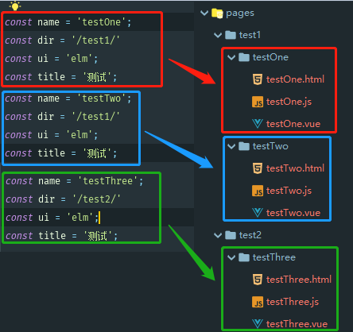
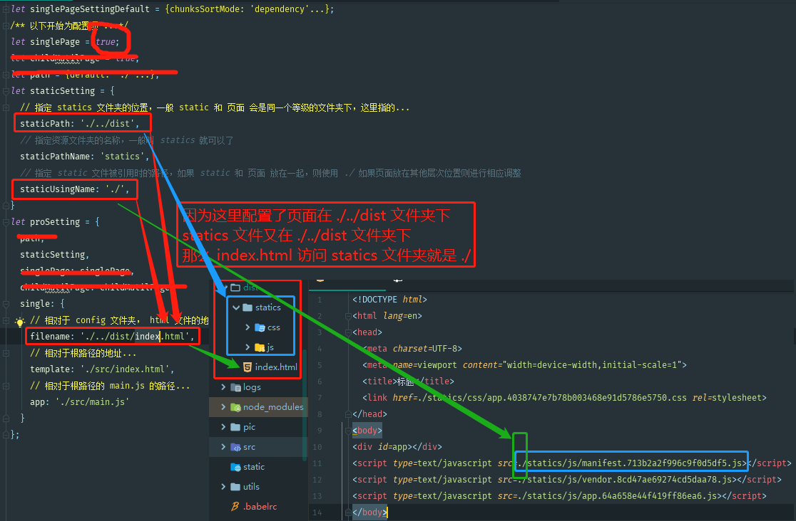
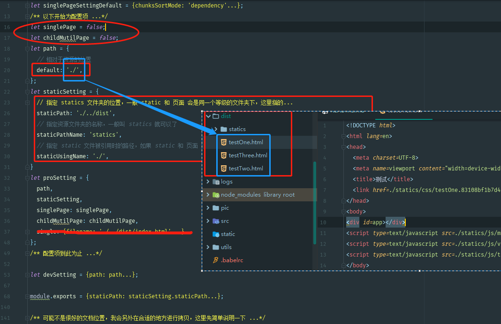
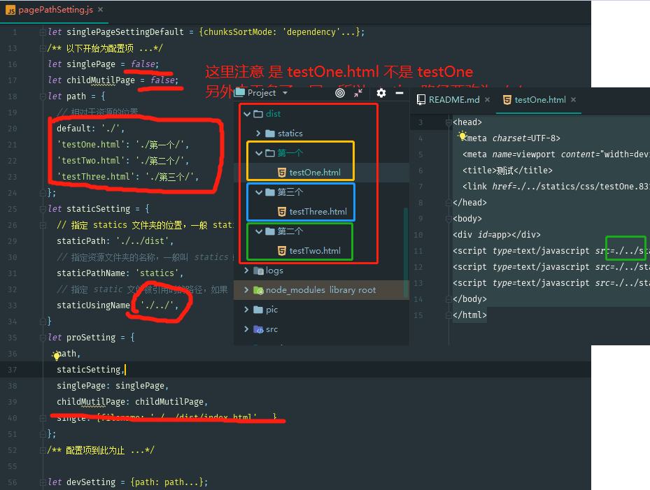
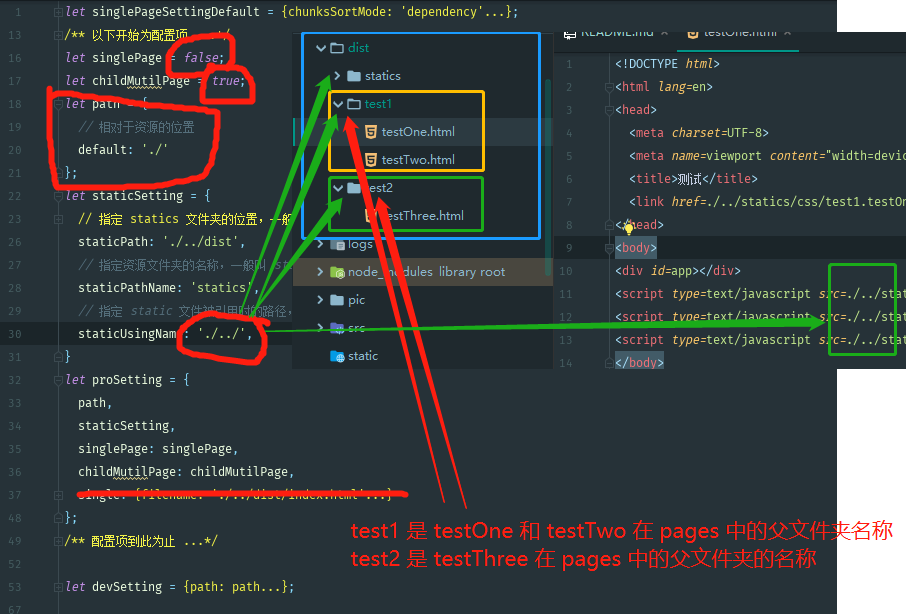
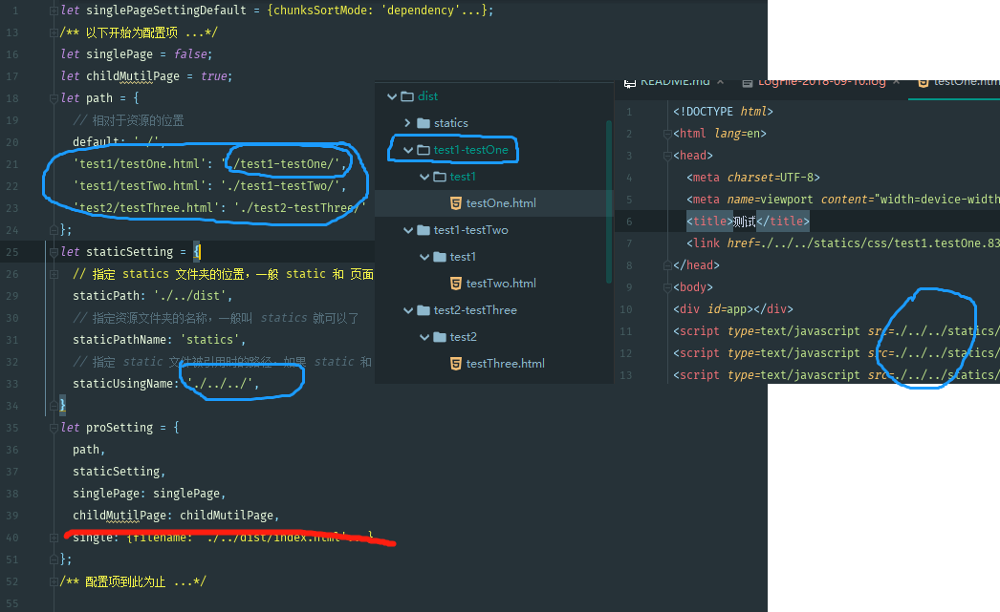

# alterVueBuildFramework
##### 多变的打包框架
##### 我觉得这么做的意义：某些场合下可能需要进行多页的开发，但是多页的【热加载时间】和页面数量呈正相关，如果改成单页则会快一点。
##### 多页配置和单页配置不难，但是麻烦，同时易错，这里通过一个配置就可以完成，另外，工程中添加了多页分文件夹打包的功能。

> 1.该工程中的页面创建统一使用 utils/createViews/createViews.js 来进行创建
```javascript
// 需要配置的内容如下
// 页面的 名称（组件名称）
const name = 'testTwo';
// 页面的路径，工程默认为可以打包为多页和单页所以需要将页面分开放置到不同的文件夹下
const dir = '/testOne/'
// ui 使用，这里默认为使用 饿了么，实际上，不同 ui 需要通过修改 main.js 中的内容，相当复杂，考虑到没有时间，这里就默认先只能使用 饿了么 ui 框架
const ui = 'elm';
// html 的标题（多页打包时可能需要）
const title = '测试';
```

>> 1.关于页面生成会经历的过程请参考 [utils/说明.txt](./utils/说明.txt)

>> 2.考虑到框架的问题，请不要将组件定义和工具类或者相关的 js 编写在 pages 文件夹内，因为这里使用了【粗暴的】文件夹扫面方法
```javascript
// 见 build/utils.js 中的 exports.entries 定义 和 mutilHtmlPlugin 定义
let entryHtml = glob.sync(PAGE_PATH + '/**/*.html')
var entryFiles = glob.sync(PAGE_PATH + '/**/*.js')
// 请能人志士有空时帮忙修改，thanks
```

>> 3.如果删除或移动或更名，请使用 utils/themeUtil/runSyncTools.js 进行同步，保证工程的正确性

> 2.该项目的重点是【打包】的配置，这里有些繁复，但是却十分需要。

| 配置项 | 说明 |
| -------- | -------- |
| singlePage | 是否适用单页打包 |
| childMutilPage | 单页打包时，是否分文件夹打包 |
| path | 单页打包时，每一个子页是否要指定特定的打包位置 |
| staticSetting | 静态资源打包时的配置 |
| proSetting | 生产环境配置 |
| devSetting | 开发环境配置 |

>> 1.singlePage、childMutilPage、path、staticSetting其实是有开发模式和生产模式的，但是时间有限没有完成，所以，当前他们的配置据哟与全局性。
>> 2.singlePage 配置为 false 时，表示多页打包，为 true 时表示单页打包
>>> true（单页打包说明）

>>> proSetting.single 和 devSetting.single 是配置单页打包的，他们区别一个 filename ，因为开发模式不需要打包成文件，另外这里让他们可以分开指定一个 template 和 一个 app 文件，是因为，页面时使用【utils/createViews/createViews.js】生成的，所以会自动将 router 文件进行修改，如果本质上开发的是单页，需要另外制定一个 template 和 app，注意这里的 index.html 和 main.js 没有限定，只有 routes.js 是限定的

>>> false(多页打包说明)

>>>> 需要配置 childMutilPage 参数和 path 参数，childMutilPage 是指定多页中，文件夹下的页面是否要分开到对应文件夹下，path 则是另外制定文件打包的位置。(看示例)

>>>>> 1.创建三个页面



>>>>> 2.配置为单页进行打包（画红线表示无关配置）



>>>>> 3.配置多页进行打包（11 不分文件夹，默认文件夹位置）



>>>>> 4.配置多页进行打包（10 不分文件夹，修改默认文件夹位置）(因为修改了位置，本质上每一个页面的static是可以不一样的，但是还是时间问题，没有解决)



>>>>> 5.配置多页进行打包(01 分文件夹打包，默人文件夹位置)



>>>>> 6.配置多页进行打包（00 分文件夹打包，配置文件夹位置）




